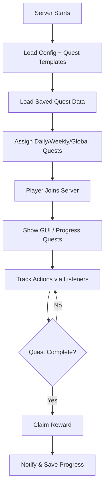

# 🎯 QuestPlugin – Modular & Dynamic Minecraft Quest System

QuestPlugin is a fully modular questing system for Minecraft servers running Paper 1.21+. Built with extensibility, player engagement, and clean UX in mind, it provides:

- 🗓️ Daily, Weekly, and Global quests
- 📚 "All Quests" tab to view everything at once
- 🎁 Skill point + Vault currency rewards
- 🧠 Smart filtering and claim tracking
- 🖼️ DecentHolograms leaderboard integration
- ✨ Animated GUI with shimmer effects
- 🛠️ Developer tools (`/questdev`) for testing

---

## 🔧 Features

| Feature                         | Description                                                       |
|---------------------------------|-------------------------------------------------------------------|
| ✅ Daily/Weekly/Global Quests   | Auto-assigned and saved across sessions                          |
| 🎨 Animated GUI                | Uses glowing buttons and shimmering glass pane borders           |
| 🧠 Quest Filtering             | Filter quests by type (e.g., Combat, Mining)                      |
| 💰 Vault + AuraSkills Support | Reward players with economy or skill points                       |
| 🏆 Leaderboards                | Dynamic hologram-based top questers using DecentHolograms         |
| ⚙️ Configurable Debug Logging | Toggle `Debug: true` in config to trace quest flow                |

---

## 🧭 Plugin Flow (Quest Lifecycle)



---

## 📥 Installation

1. Place `QuestPlugin.jar` in your server's `plugins/` folder
2. Start the server once to generate config files
3. Edit `config.yml`, `quests.yml`, and `plugin.yml` to your liking
4. Install:
   - Vault (for economy)
   - AuraSkills (optional skill reward API)
   - DecentHolograms (for holographic leaderboards)
5. Restart your server

---

## 🔧 Configuration

### `config.yml`

```yaml
Debug: true
QuestReset:
  Daily: true
  Weekly: true
```

---

## 🧪 Developer Tools

Use `/questdev` commands to:
- Give players quests
- Test triggers
- Reset quest progress

---

## 🔗 Dependencies

| Plugin            | Purpose               |
|-------------------|------------------------|
| [Vault]           | Economy reward support |
| [AuraSkills]      | Skill reward API       |
| [DecentHolograms] | Leaderboard display    |

---

## 📜 License

This plugin is open-source and freely modifiable.

---

## 🙌 Contributing

Feel free to fork, submit PRs, or suggest ideas!
