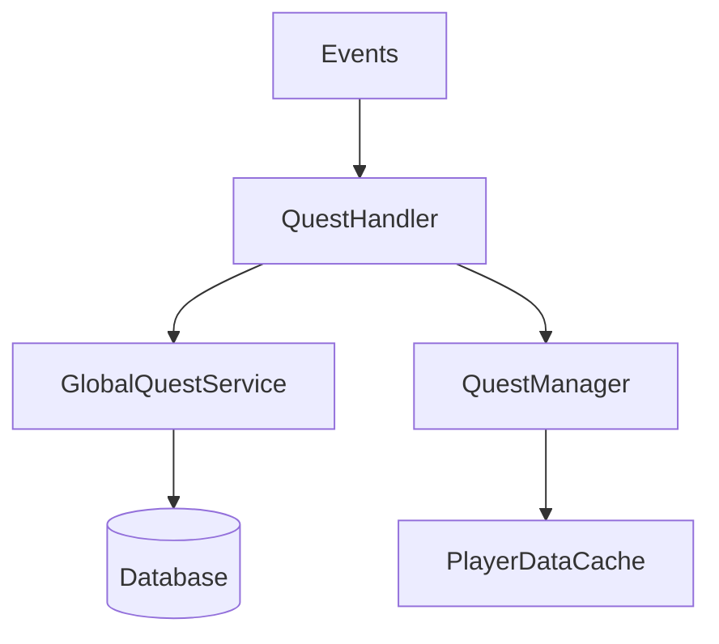

# QuestPlugin Refactor (1.21.4+)

 


## 🚀 Key Refactor Changes

### 🔧 Core Architecture

📦 New Components
Component	Purpose
QuestHandler	Central progression logic
GlobalQuestService	Server-wide quest management
QuestStorageService	Async SQLite storage
ConfigManager	Type-safe configuration

💡 Developer API
🎯 Creating Custom Quests
Add QuestType:

```java
Copy
public enum QuestType {
    // Existing types...
    CUSTOM_EVENT
}
Implement Listener:

java
Copy
public class CustomListener extends BaseListener {
    @EventHandler
    public void onCustomEvent(CustomEvent e) {
        processEvent(e, () -> 
            new QuestEventData(
                QuestType.CUSTOM_EVENT,
                e.getKey(),
                e.getAmount()
            )
        );
    }
}
```
📊 Leaderboard Integration
```java
Copy
// Custom scoreboard section
public class CustomLeaderboard implements SidebarSection {
    @Override
    public SidebarFrame getFrame(Player p) {
        return player -> List.of(
            "Your Points: " + QuestPlugin.getInstance()
                .getLeaderboardManager()
                .getScore(player.getUniqueId())
        );
    }
}
```
🛠️ Admin Commands
```bash
/questadmin migrate      # Convert YAML to SQLite
/questadmin resetglobal  # Refresh global quests
```
🧰 Developer Commands
```bash
/questdev simreset       # Test daily reset logic
/questdev dumpcache      # Debug memory cache
```
📂 Project Structure
```
src/
├── main/
│   ├── java/
│   │   └── com/example/questplugin/
│   │       ├── core/         # Core systems
│   │       ├── commands/     # Command handlers
│   │       ├── enums/        # Quest types/tiers
│   │       └── listeners/    # Event handlers
│   └── resources/            # Config files
```
🚀 Quick Start
Add Dependency:

```xml
<dependency>
    <groupId>com.example</groupId>
    <artifactId>questplugin</artifactId>
    <version>1.1.0</version>
    <scope>provided</scope>
</dependency>
```
Register Events:
```java
Copy
public class MyPlugin extends JavaPlugin {
    @Override
    public void onEnable() {
        new CustomListener(this); // Auto-registers
    }
}
```
📜 License
MIT License - See LICENSE
